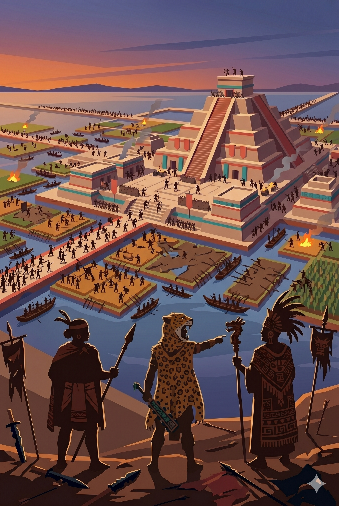

# Reinos del Quinto Sol

Juego de estrategia en tiempo real online, open source, inspirado en las civilizaciones prehispanicas de Mesoamerica.



<p align="center">
  
</p>

Los archivos fuente del cartel y el icono están en [`assets/sprites/poster.png`](assets/sprites/poster.png) y [`assets/sprites/icon.png`](assets/sprites/icon.png) (tambien hay [`assets/sprites/icon.svg`](assets/sprites/icon.svg) vectorial).

## Objetivo

Construir un RTS online con jugabilidad familiar para fans de los clasicos del genero: recoleccion de recursos, construccion de ciudades, unidades militares, tecnologias, exploracion, niebla de guerra y partidas competitivas.

El proyecto toma inspiracion mecanica de los RTS historicos, pero sera una obra original: codigo, arte, balance, nombres, musica, campanas y direccion visual propios.

## Estructura

```text
apps/
  client/   Cliente web del juego
  server/   Servidor autoritativo para partidas online
packages/
  shared/   Tipos, datos y reglas compartidas
docs/
  plan-inicial.md
  historia/
  diseno/
  tecnica/
assets/
  sprites/
  audio/
  mapas/
```

## Stack inicial propuesto

- TypeScript
- Vite + React para interfaz web
- Phaser para gameplay 2D
- Node.js para servidor
- WebSocket o Colyseus para multiplayer

## Servidor local de desarrollo

Requisitos: Node.js **20 o superior** y npm instalado.

1. Instala dependencias desde la raiz del monorepositorio:

   ```bash
   npm install
   ```

2. Arranca el servidor de desarrollo del cliente (Vite). Sirve la aplicacion en tu maquina:

   ```bash
   npm run dev --workspace @reinos/client -- --host 127.0.0.1 --port 5173
   ```

3. Abre el juego en el navegador: [http://127.0.0.1:5173](http://127.0.0.1:5173).

En esta configuracion el cliente intentara enlazar opcionalmente con el proceso WebSocket del juego (por defecto `ws://127.0.0.1:8787`). **Si ese servicio no esta en marcha**, el prototipo corre en modo local pensado como **campaña en solitario (no cooperativa)**: enfrentar bestias miticas en el mapa, gestionar economia y construir edificios, sin otros jugadores humanos aliados ni sesion multiplayer compartida.

Para pruebas de partida online contra otro cliente en la misma red o maquina, en otra terminal puedes ejecutar `npm run dev --workspace @reinos/server`; el comportamiento anterior corresponde a cuando solo levantas el cliente.

## Pipeline visual y audio de aldeanos

El cliente carga hojas PNG para aldeanos por cultura desde `assets/sprites/aldeanos/`, con variantes masculino/femenina solo esteticas y audio procedural de seleccion/orden. El formato de grilla, fallback procedural y decisiones de licencia quedan documentados en `docs/diseno/aldeanos-arte-audio.md`.

## Licencia

Propuesta inicial:

- Codigo: GPLv3
- Assets y documentacion: CC BY-SA 4.0

La licencia definitiva debe confirmarse antes de aceptar contribuciones externas.
